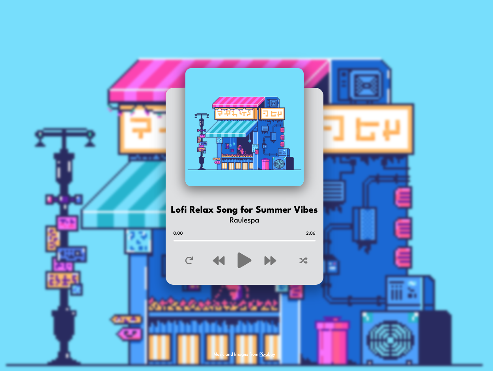

<h1 align="center">Lofi Music Player</h1>

  <h3>
    <a href="https://globoivic.github.io/Music-Player/">
      Demo
    </a>
     | 
    <a href="https://github.com/GloBoiVic/Music-Player">
      Github Repo
    </a>
  </h3>

## :page_facing_up: General Information

A Lofi Music Player to help dev stay in the zone while coding

## :computer: Technologies Used

- HTML
- CSS
- JavaScript

## :fire: Features

- Click play and listen to some of the best lofi songs curated by me

## :camera: Screenshots

## :heavy_exclamation_mark: Room for Improvement

To improve this project, I would like to:

- Add shuffle functionality to shuffle songs on the playlist
- Add repeat functionality to repeat favorite song on the playlist
- Add ability to upload your own songs (Might be ambitious!)

## :bust_in_silhouette: Contact

- GitHub [@GloBoiVic](https://github.com/GloBoiVic) - please reach out to me! I want to connect with other developers!
